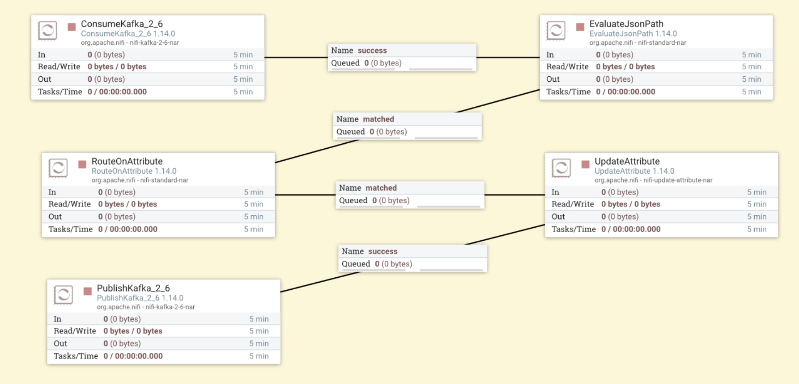

# My Big Data Experience

This repository showcases my experience with Big Data technologies such as Apache Spark, NiFi, HDFS and Kafka. Below, I provide an overview of the tools I have used, the projects I have worked on, and how these technologies come together to solve real-world data processing challenges.

---

## Tools & Technologies

### 1. **Apache Spark**
Apache Spark has been at the core of my big data projects, allowing me to perform distributed data processing at scale. I have worked with PySpark for:

- **Batch processing**: Aggregating and analyzing large datasets stored in HDFS.
- **Streaming**: Using Spark Structured Streaming to process real-time data from Kafka topics.
- **Data transformations**: Implementing ETL pipelines to clean, filter, and prepare data for downstream analytics.

**Example Project**: 
In one of my projects, I processed tennis match data using PySpark to:
- Identify players who participated in the most matches and sets.
- Compute the proportion of matches won by left-handed players versus right-handed players.
- Save results to HDFS in Parquet format for further analysis.

### 2. **Apache NiFi**
Apache NiFi has been an invaluable tool for building automated data pipelines. My expertise includes:

- **Integrating Kafka**: Consuming IoT data streams from Kafka topics, filtering based on conditions, and republishing filtered messages to another topic.
- **Transforming data**: Using processors like `ConvertRecord`, `RouteOnAttribute`, and `UpdateAttribute` for JSON-to-CSV conversions and enriching metadata.
- **Writing to HDFS**: Designing pipelines to store processed data in HDFS for long-term storage.

**Example Project**:
In a NiFi flow, I:
- Subscribed to a Kafka topic named `iotinfo` to process IoT sensor data.
- Filtered messages exceeding specific thresholds (e.g., CO > 0.005).
- Published filtered data to a new Kafka topic named `alerts`.
- Saved all processed data to HDFS in CSV format.

## Screenshots

### NiFi Flow: IoT Data Processing Pipeline

### NiFi Flow: HDFS Data Transformation

### 3. **HDFS (Hadoop Distributed File System)**
HDFS has been a primary storage layer for my big data projects. I have used it to:

- Store large datasets like IoT streams and historical match data.
- Optimize data formats using Parquet for better performance.
- Retrieve data programmatically through Spark and NiFi.

### 4. **Apache Kafka**
Apache Kafka has been a central component in my projects involving real-time data streams. I have:

- Configured producers to publish JSON messages to Kafka topics.
- Subscribed to topics using NiFi and Spark Structured Streaming for downstream processing.
- Designed pipelines to publish alerts or processed data back to Kafka for other consumers.

**Example Workflow**:
A Kafka producer published IoT data (device measurements, timestamps) to a topic. Using NiFi, I subscribed to this topic, filtered messages based on thresholds, and republished alerts to another Kafka topic while saving all data to HDFS for batch processing.

---

## Key Skills Gained
- Distributed data processing with Spark.
- Real-time streaming with Kafka and NiFi.
- Batch processing and storage using Hadoop and HDFS.
- Building scalable, end-to-end data pipelines.

---
